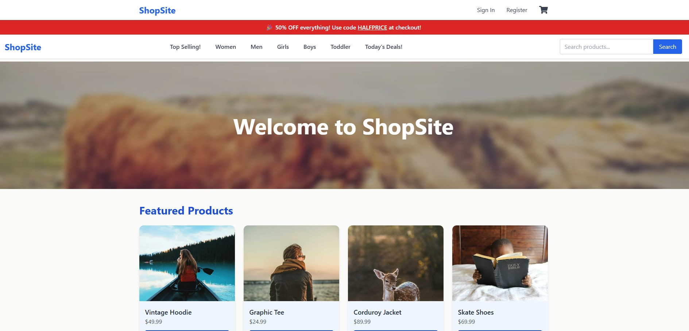

## ShopSite 



## 🚀 Project Overview

ShopSite is a responsive React e-commerce storefront designed to showcase practical frontend skills including:

- ✅ Category filtering and search  
- ✅ Infinite scrolling product listings  
- ✅ Featured products highlight  
- ✅ Product detail pages with images  
- ✅ Shopping cart with size and quantity management  
- ✅ PayPal sandbox integration for checkout  
- ✅ Optional sign-in or guest checkout flow  
- ✅ Clean, modern UI styled with Tailwind CSS  

This project serves both as a functional demo and a portfolio piece demonstrating React and modern web development best practices. It lays a strong foundation for a fully functional shopping website that can be extended with backend services for real-world deployments.

---

## 🛠 Technologies Used

- ⚛️ **React.js** — Component-based UI library for building dynamic user interfaces  
- 🛣 **React Router** — Client-side routing for seamless navigation  
- 🎨 **Tailwind CSS** — Utility-first CSS framework for rapid, customizable styling  
- 📜 **JavaScript (ES6+)** — Modern scripting language for frontend logic  
- 💳 **PayPal React SDK** — Integration of PayPal payment buttons for sandbox checkout  
- 🗂 **Context API** — State management for shopping cart functionality  

---

## ✨ Features

- 📦 Dynamic product catalog with category filtering and search  
- 🔄 Infinite scroll for efficient product loading  
- 🖼 Product detail pages with image galleries  
- 🛒 Persistent shopping cart with size and quantity selection  
- 🔐 Secure user authentication (sign-in and registration)  
- 💰 PayPal sandbox checkout for payment simulation  
- 📱 Responsive design optimized for all device sizes  

---

## ⚙️ Getting Started

### 🔧 Prerequisites

- Node.js and npm installed

### 🚀 Installation & Running

```bash
git clone https://github.com/Mreigel/Shopsite.git
cd Shopsite
npm install
npm start
```

Open [http://localhost:3000](http://localhost:3000) in your browser

---

## 📖 Usage

- 🔍 Browse products and filter by category or search terms  
- ➕ Add items to your cart with size selection  
- 💳 Proceed to checkout using PayPal sandbox integration  
- 👤 Sign in or checkout as guest for flexible user experience  

---

## 🔮 Future Work & Potential

This project is designed to evolve into a fully functional e-commerce platform with:

- 🛠 Backend APIs for product and user data management  
- 💳 Secure payment processing with live PayPal or Stripe integration  
- 📊 Admin dashboard for product, order, and user management  
- ☁️ Cloud deployment on platforms like AWS, Vercel, or Netlify  

---

## 📜 License

MIT License

---

## 📬 Contact

- 🔗 LinkedIn: [michaelreigel](https://linkedin.com/in/michaelreigel)  
- 🐙 GitHub: [Mreigel](https://github.com/Mreigel)
